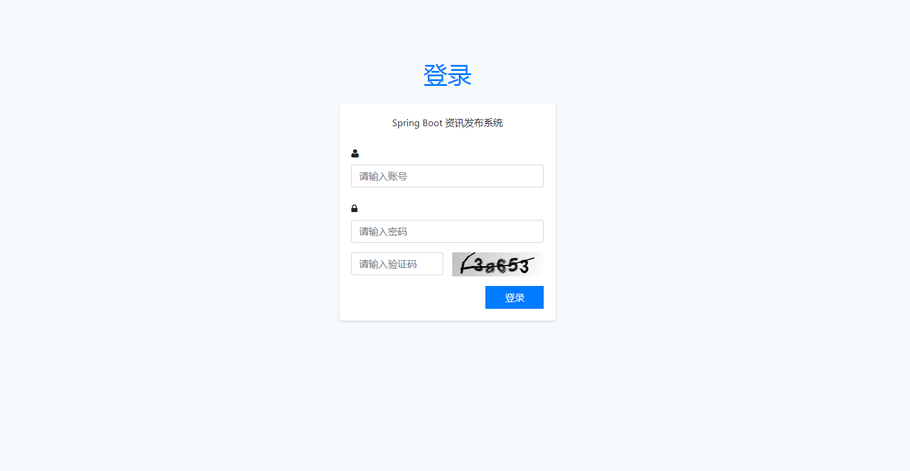
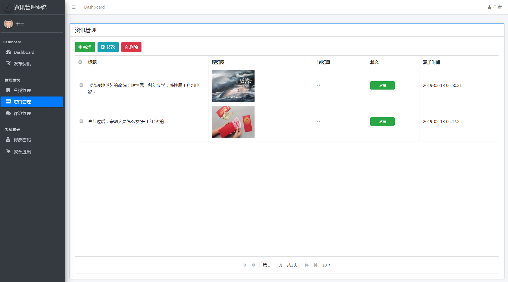
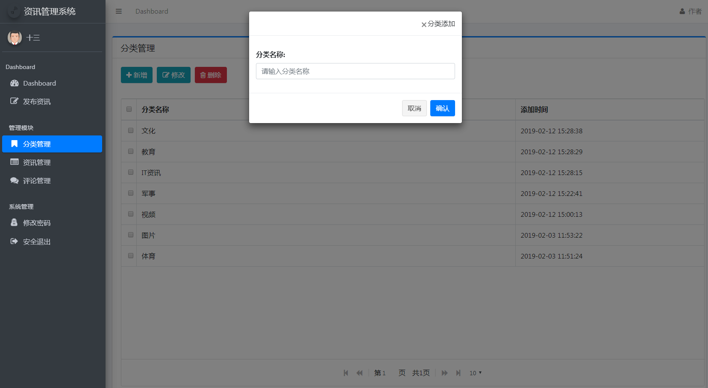
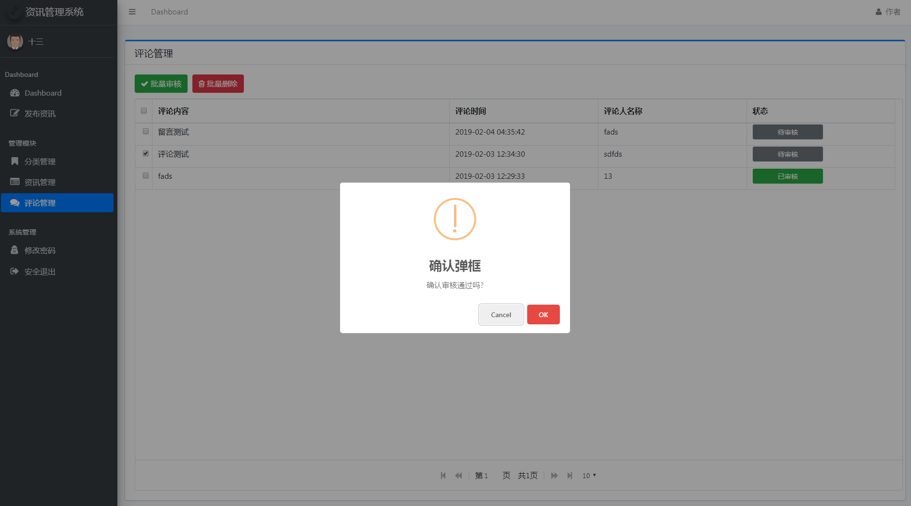
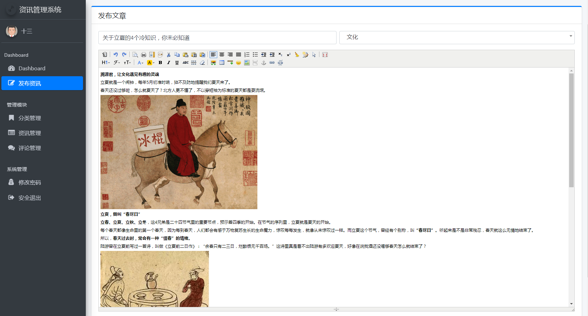

# Spring Boot 资讯发布系统实战项目源码

## 1 简介

开发一个Spring Boot 资讯发布系统实战项目

## 2 部署

JDK17

1.使用.sql中的语句建表

2.使用idea打开springboot-project-new-publish...文件夹

3.使用idea连接数据库中的springboot3_db表

4.改变application.properties文件中的

```
spring.datasource.username=
spring.datasource.password=
```

5.运行Application

6.浏览器打开 http://localhost:8080/admin/login.html 登录页

## 3 项目展示

下面的这个展示就是原项目的展示哩

以下为实践项目的页面和功能展示，分别为：

- 登录页面



- 列表页面(分页功能)



- 添加



- 修改



- 富文本编辑器整合使用



实践项目的主要功能和页面就是这些，通过项目展示大家也能够感受到，在实际应用开发中的高频次功能都已经实现，稍加修改就可以运用到企业开发中，希望大家能够了解并且能够实际的上手开发。

## 4 总结

**1.session**

HTTP sessions 是一种行业标准功能，它允许 Web servers 在 client application 和 Web application 之间的多个 request/response 交互期间维护 user identity 并存储用户特定的数据。 HTTP sessions 保留：

- 有关 session 本身的信息（session identifier、creation time、time last accessed 等）

- 有关 user 的上下文信息（例如，client login state，以及 Web application 需要保存的任何其他内容）

**2.HandlerInterceptor**

在进入 HandlerInterceptor 之前，让我们讨论一下 HandlerMapping。它用于将方法 maps 到特定的 URL。以便 DispatcherServlet 能够在处理 request 时调用它。 此外，DispatcherServlet 使用 HandlerAdapter 来调用该方法。

现在我们对 context 有了一个快速的了解，这是 HandlerInterceptor 发挥作用的时候了。 它具有 before handling、after handling 和 after completion（渲染视图对象）等三个阶段。它允许开发人员在请求处理的各个阶段添加自定义逻辑，例如记录请求日志、权限验证、跨站点请求伪造（CSRF）防护等。

